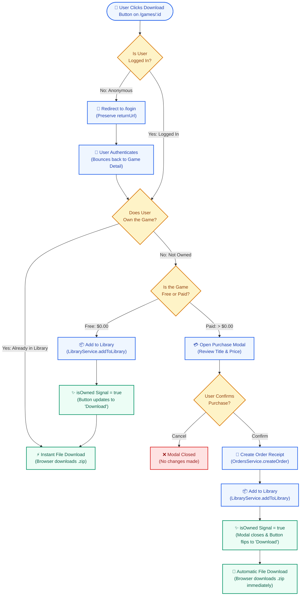

# Explanation: Download Flow

This document explains the logic behind the game download flow. For step-by-step guidance on implementing the UI, see the [Download Flow Tutorial](tutorial-download-flow.md).

## The Problem

We need to gate game downloads. Free games require ownership tracking. Paid games require purchase confirmation. All games require authentication. The flow must gracefully handle deleted games that users already own.

## The Design

We chose a strict, single-branch path for the download action. Every download requires authentication. There is no special "guest download" path for free games. 

Ownership is tracked via a `LibraryEntry` record, not a boolean field on the `Game` itself. This decouples the catalog from user state.

### Download Button States

The download button manages five distinct states:

1. **Anonymous:** User is not logged in. Clicking prompts a redirect to the login page.
2. **Free + Unowned:** Game is free. Clicking adds a `LibraryEntry` and starts the download.
3. **Paid + Unowned:** Game costs money. Clicking opens the purchase confirmation modal.
4. **Owned:** User has a `LibraryEntry` for the game. Clicking downloads the file immediately.
5. **Deleted:** Game was soft-deleted by the creator. If the user owns it, the button shows "Unavailable" and is disabled.

### The Free vs. Paid Branch

The flow diverges at the initial click for unowned games:
- Free games immediately create a library entry.
- Paid games open a modal (Title, Price, Confirm/Cancel). No fake payment fields are required.

The flow converges after the specific action completes. Both branches end by creating a `LibraryEntry` and transitioning the button to the "Owned" state.

## Trade-off

Requiring an account to download free games adds friction for users. However, it simplifies the architecture by forcing all downloads through the same auth-gated pipeline. This exercises more code paths (registration, library tracking) and keeps the data model consistent.

