# NEXORA — Pages & Components Map

Every page, every component it contains, every input/output, and every service dependency in **NEXORA** — in one document.

---

## Master Component Registry

> **Status Key:** ✅ = Built & Verified | 🔲 = Placeholder Shell (route exists, awaiting Phase 3 implementation) | ⏳ = Planned (not yet created)

| Component                        | Status | Type    | File Path                                | Inputs                                                                             | Outputs                                                 | Used On                                       |
|----------------------------------|:------:|---------|------------------------------------------|------------------------------------------------------------------------------------|---------------------------------------------------------|-----------------------------------------------|
| `AppComponent`                   | ✅     | Shell   | `app/app.component.ts`                   | —                                                                                  | —                                                       | Root                                          |
| `HeaderComponent`                | ✅     | Layout  | `app/layout/header/`                     | —                                                                                  | —                                                       | All pages                                     |
| `FooterComponent`                | ✅     | Layout  | `app/layout/footer/`                     | —                                                                                  | —                                                       | All pages                                     |
| `GameCatalogComponent`           | ✅     | Page    | `app/features/game-catalog/`             | —                                                                                  | —                                                       | `/catalog`                                    |
| `GenreDirectoryComponent`        | ✅     | Page    | `app/features/genres/`                   | —                                                                                  | —                                                       | `/genres`                                     |
| `GameDetailComponent`            | ✅     | Page    | `app/features/game-detail/`              | —                                                                                  | —                                                       | `/games/:id`                                  |
| `CreatorProfileComponent`        | ✅     | Page    | `app/features/creator-profile/`          | —                                                                                  | —                                                       | `/creators/:id`                               |
| `LoginComponent`                 | ✅     | Page    | `app/features/auth/login/`               | —                                                                                  | —                                                       | `/login`                                      |
| `RegisterComponent`              | ✅     | Page    | `app/features/auth/register/`            | —                                                                                  | —                                                       | `/register`                                   |
| `ForgotPasswordComponent`        | ✅     | Page    | `app/features/auth/forgot-password/`     | —                                                                                  | —                                                       | `/forgot-password`                            |
| `LibraryComponent`               | ✅     | Page    | `app/features/library/`                  | —                                                                                  | —                                                       | `/library`                                    |
| `WishlistComponent`              | ✅     | Page    | `app/features/wishlist/`                 | —                                                                                  | —                                                       | `/wishlist`                                   |
| `OrdersComponent`                | ✅     | Page    | `app/features/orders/`                   | —                                                                                  | —                                                       | `/orders`                                     |
| `ProfileComponent`               | ✅     | Page    | `app/features/profile/`                  | —                                                                                  | —                                                       | `/profile`                                    |
| `AccountPaymentComponent`        | ✅     | Page    | `app/features/account-payment/`          | —                                                                                  | —                                                       | `/account/payment`                            |
| `CreatorStudioComponent`         | ✅     | Page    | `app/features/creator-studio/`           | —                                                                                  | —                                                       | `/studio`                                     |
| `GameFormComponent`              | ✅     | Page    | `app/features/creator-studio/game-form/` | —                                                                                  | —                                                       | `/studio/games/new`, `/studio/games/:id/edit` |
| `SupportComponent`               | ✅     | Page    | `app/features/support/`                  | —                                                                                  | —                                                       | `/support`                                    |
| `NotFoundComponent`              | ✅     | Page    | `app/features/not-found/`                | —                                                                                  | —                                                       | `/not-found`, `**`                            |
| `GameCardComponent`              | ✅     | Shared  | `app/shared/ui/game-card/`               | `game: Game`, `isWishlisted?: boolean`                                             | `(select)`, `(toggleWishlist)`                          | Catalog, Genres, Wishlist, CreatorProfile     |
| `DownloadButtonComponent`        | ✅     | Shared  | `app/shared/ui/download-button/`         | `game: Game`, `isOwned: boolean`, `platform?: PlatformType`                       | `(download)`, `(loginRequired)`, `(purchaseConfirmed)`  | Detail, Library                               |
| `PurchaseConfirmModalComponent`  | ✅     | Shared  | `app/shared/ui/purchase-confirm-modal/`  | `game: Game`, `processing?: boolean`                                               | `(confirm)`, `(cancel)`                                 | Detail                                        |
| `KhqrCardComponent`              | ✅     | Shared  | `app/shared/ui/khqr-card/`               | `method: KhqrPaymentMethod`                                                        | `(delete)`, `(setDefault)`                              | AccountPayment                                |
| `PaymentBrandMarkComponent`      | ✅     | Shared  | `app/shared/ui/payment-brand-mark/`      | `brand: CardBrand \| string`                                                       | —                                                       | AccountPayment, PurchaseConfirm               |
| `GenreIconComponent`             | ✅     | Shared  | `app/shared/ui/genre-icon/`              | `genre: string`                                                                    | —                                                       | Genres, Catalog                               |
| `ToastComponent`                 | ✅     | Shared  | `app/shared/ui/toast/`                   | —                                                                                  | —                                                       | Shell (App Root)                              |
| `CommandPaletteComponent`        | ✅     | Shared  | `app/shared/ui/command-palette/`         | —                                                                                  | —                                                       | Shell (App Root)                              |
| `DownloadTrayComponent`          | ✅     | Shared  | `app/shared/ui/download-tray/`           | —                                                                                  | —                                                       | Shell (App Root)                              |
| `AmbientSpotlightComponent`      | ✅     | Shared  | `app/shared/ui/ambient-spotlight/`       | `color?: string`                                                                   | —                                                       | Detail, Catalog                               |
| `ShapeGridComponent`             | ✅     | Shared  | `app/shared/ui/shape-grid/`              | —                                                                                  | —                                                       | Auth, Support                                 |
| `LoadingSpinnerComponent`        | ✅     | Shared  | `app/shared/ui/loading-spinner/`         | `size?: 'sm' \| 'md' \| 'lg'`                                                      | —                                                       | Catalog, Detail, Library, Studio, Wishlist     |
| `EmptyStateComponent`            | ✅     | Shared  | `app/shared/ui/empty-state/`             | `message: string`, `icon?: string`, `actionLabel?: string`, `actionRoute?: string` | `(action)`                                              | Catalog, Library, Studio, Wishlist, Creator   |
| `RoleBadgeComponent`             | ✅     | Shared  | `app/shared/ui/role-badge/`              | `role: 'buyer' \| 'creator'`, `size?: 'sm' \| 'md'`                                 | —                                                       | Header, Profile, CreatorProfile               |
| `TagChipInputComponent`          | ✅     | Shared  | `app/shared/ui/tag-chip-input/`          | `tags: string[]`, `max: number`                                                    | `(tagsChange)`                                          | GameForm                                      |

---

## Directives Registry

| Directive                | Selector              | File Path                                        | Purpose                                                                             |
|--------------------------|-----------------------|--------------------------------------------------|-------------------------------------------------------------------------------------|
| `CardNumberDirective`    | `[appCardNumber]`     | `app/shared/directives/card-number.directive.ts` | 4-digit block spacing with caret-safe cursor position retention                     |
| `CvvDirective`           | `[appCvv]`            | `app/shared/directives/cvv.directive.ts`         | Numeric restriction and 4-character ceiling                                         |
| `ExpiryDateDirective`    | `[appExpiryDate]`     | `app/shared/directives/expiry-date.directive.ts` | Dynamic MM/YY slash insertion with caret preservation                               |
| `ScrollLockDirective`    | `[appScrollLock]`     | `app/shared/directives/scroll-lock.directive.ts`  | Connects host component lifecycle to `ScrollLockService` ref-counting                |
| `SpatialNavDirective`    | `[appSpatialNav]`     | `app/shared/directives/spatial-nav.directive.ts` | 2D Arrow-key grid traversal, focus boundary lock, and gamepad ergonomics           |

---

## Page-by-Page Breakdown

---

### 1. Game Catalog — `/catalog`

**Component:** `GameCatalogComponent`
**File:** `app/features/game-catalog/game-catalog.component.ts`
**Guards:** None — public

```
┌─────────────────────────────────────────────────────┐
│  HEADER                                             │
├─────────────────────────────────────────────────────┤
│                                                     │
│  ┌───────────────────────────────────────────────┐  │
│  │ 🔍  Search games...                           │  │
│  └───────────────────────────────────────────────┘  │
│                                                     │
│  [ Action ] [ RPG ] [ Puzzle ] [ Horror ] [ Adventure ]  │
│      ↑ tag filter chips (single-select)             │
│                                                     │
│  ┌──────────┐  ┌──────────┐  ┌──────────┐          │
│  │          │  │          │  │          │          │
│  │  cover   │  │  cover   │  │  cover   │          │
│  │  image   │  │  image   │  │  image   │          │
│  │          │  │          │  │          │          │
│  ├──────────┤  ├──────────┤  ├──────────┤          │
│  │ Title    │  │ Title    │  │ Title    │          │
│  │ $4.99    │  │ Free     │  │ $9.99    │          │
│  └──────────┘  └──────────┘  └──────────┘          │
│   GameCard[]     ↑ CSS Grid, responsive             │
│                                                     │
│  ─ ─ ─ OR ─ ─ ─                                    │
│                                                     │
│  ┌───────────────────────────────────────────────┐  │
│  │  🎮  No games match your search               │  │
│  │      Try different keywords or clear filters   │  │
│  └───────────────────────────────────────────────┘  │
│      EmptyState (when 0 results)                    │
│                                                     │
├─────────────────────────────────────────────────────┤
│  FOOTER                                             │
└─────────────────────────────────────────────────────┘
```

**Child components on this page:**

| Component                 | How it's used                                                           |
|---------------------------|-------------------------------------------------------------------------|
| `GameCardComponent`       | One per game in the grid. Emits `(select)` → navigates to `/games/:id` |
| `LoadingSpinnerComponent` | Shown while `getGames()` resolves                                       |
| `EmptyStateComponent`     | Shown when search/filter returns 0 results                              |

**Services injected:**

| Token        | Method called        | Purpose                                                 |
|--------------|----------------------|---------------------------------------------------------|
| `GAMES_DATA` | `getGames(filters?)` | Fetch catalog, optionally filtered by `tag` and `search` |

**Signals / State:**

| Signal        | Type                     | Purpose                                                     |
|---------------|--------------------------|-------------------------------------------------------------|
| `games`       | `Signal<Game[]>`         | Current filtered game list                                  |
| `searchQuery` | `Signal<string>`         | Bound to search input                                       |
| `activeTag`   | `Signal<string \| null>` | Currently selected tag chip                                 |
| `loading`     | `Signal<boolean>`        | Loading state                                               |
| `allTags`     | `Signal<string[]>`       | Computed from all games' `tags` arrays (dynamic vocabulary) |

---

### 2. Game Detail — `/games/:id`

**Component:** `GameDetailComponent`
**File:** `app/features/game-detail/game-detail.component.ts`
**Guards:** None — public (but download action is gated)

```
┌─────────────────────────────────────────────────────┐
│  HEADER                                             │
├─────────────────────────────────────────────────────┤
│                                                     │
│  ┌─────────────────────────────────────────────────┐│
│  │                                                 ││
│  │              HERO COVER IMAGE                   ││
│  │              (coverImageUrl)                    ││
│  │                                                 ││
│  └─────────────────────────────────────────────────┘│
│                                                     │
│  ┌──────────────────────┐  ┌──────────────────────┐ │
│  │  INFO COLUMN         │  │  ACTION COLUMN       │ │
│  │                      │  │                      │ │
│  │  Game Title          │  │  $4.99  or  Free     │ │
│  │  by CreatorName      │  │                      │ │
│  │                      │  │  ┌────────────────┐  │ │
│  │  Description text    │  │  │ Download Free  │  │ │
│  │  that wraps to       │  │  │   or Buy $X    │  │ │
│  │  multiple lines...   │  │  └────────────────┘  │ │
│  │                      │  │   DownloadButton     │ │
│  │  [RPG] [Action]      │  │                      │ │
│  │   tag chips          │  │                      │ │
│  └──────────────────────┘  └──────────────────────┘ │
│                                                     │
│  ┌────────┐ ┌────────┐ ┌────────┐ ┌────────┐        │
│  │ screen │ │ screen │ │ screen │ │ screen │        │
│  │ shot 1 │ │ shot 2 │ │ shot 3 │ │ shot 4 │        │
│  └────────┘ └────────┘ └────────┘ └────────┘        │
│   ← horizontal scroll row →                         │
│                                                     │
│  ┌─────────────────────────────────────────────────┐│
│  │  PurchaseConfirmModal (overlay, conditional)    ││
│  │  ┌──────────────────────────────────────────┐   ││
│  │  │  Purchase "Game Title" for $4.99?        │   ││
│  │  │                                          │   ││
│  │  │        [ Cancel ]    [ Confirm ]         │   ││
│  │  └──────────────────────────────────────────┘   ││
│  └─────────────────────────────────────────────────┘│
│                                                     │
├─────────────────────────────────────────────────────┤
│  FOOTER                                             │
└─────────────────────────────────────────────────────┘
```

**Child components on this page (current Phase 2 state):**

| Component                       | How it's used                                                                                       | Status |
|---------------------------------|-----------------------------------------------------------------------------------------------------|:------:|
| `LoadingSpinnerComponent`       | While `getGameById()` resolves                                                                      | ✅     |
| `DownloadButtonComponent`       | ⏳ *Planned (Phase 3)* — will render 5 states based on auth + ownership + price                     | ⏳     |
| `PurchaseConfirmModalComponent` | ⏳ *Planned (Phase 3)* — will render conditionally for paid game purchase confirmation              | ⏳     |

> **Note:** In the current Phase 2 implementation, the Game Detail page uses a direct action button (`button.btn-action-main`) for Buy/Download and a separate wishlist toggle button (`button.btn-wishlist-action`). The `DownloadButtonComponent` and `PurchaseConfirmModalComponent` are planned for Phase 3.

**Services injected (current Phase 2 state):**

| Token          | Method called                            | Purpose                                |
|----------------|------------------------------------------|----------------------------------------|
| `GAMES_DATA`   | `getGameById(id)`                        | Fetch game details                     |
| `USERS_DATA`   | `getUser(game.ownerId)`                  | Resolve creator display name           |
| `AuthService`  | `currentUser()`                          | Check auth state for button logic      |

**Signals / State (current Phase 2 state):**

| Signal              | Type                        | Purpose                             |
|---------------------|-----------------------------|-------------------------------------|
| `game`              | `Signal<Game \| undefined>` | Loaded game data                    |
| `creatorName`       | `Signal<string>`            | Resolved display name               |
| `loading`           | `Signal<boolean>`           | Loading state                       |

---

### 3. Login — `/login`

**Component:** `LoginComponent`
**File:** `app/features/auth/login/login.component.ts`
**Guards:** None

```
┌─────────────────────────────────────────────────────┐
│  HEADER                                             │
├─────────────────────────────────────────────────────┤
│                                                     │
│              ┌──────────────────────┐               │
│              │                      │               │
│              │     Log In           │               │
│              │                      │               │
│              │  Email               │               │
│              │  ┌────────────────┐  │               │
│              │  │                │  │               │
│              │  └────────────────┘  │               │
│              │                      │               │
│              │  Password            │               │
│              │  ┌────────────────┐  │               │
│              │  │                │  │               │
│              │  └────────────────┘  │               │
│              │  Forgot password?    │               │
│              │                      │               │
│              │  ┌────────────────┐  │               │
│              │  │    Log In      │  │               │
│              │  └────────────────┘  │               │
│              │                      │               │
│              │  ── or continue ──   │               │
│              │                      │               │
│              │  [G] Google  [🍎] Apple│             │
│              │   social login SVGs  │               │
│              │                      │               │
│              │  ── quick login ──   │               │
│              │                      │               │
│              │  (alice) (bob) (carol)│               │
│              │   demo account pills │               │
│              │                      │               │
│              │  Don't have an       │               │
│              │  account? Register   │               │
│              │                      │               │
│              └──────────────────────┘               │
│                                                     │
├─────────────────────────────────────────────────────┤
│  FOOTER                                             │
└─────────────────────────────────────────────────────┘
```

**Child components:** None (self-contained form)

**Services injected:**

| Token            | Method called              | Purpose                                                                                                                                                                                                                                        |
|------------------|----------------------------|------------------------------------------------------------------------------------------------------------------------------------------------------------------------------------------------------------------------------------------------|
| `AuthService`    | `login(email, password)`   | Look up a seeded user by `email`; `password` is accepted for form parity but never checked — see [How to Set Up the Auth & Guard System](howto-auth-system.md#2-implement-the-mock-auth-logic)                                                |
| `AuthService`    | `socialLogin(provider)`    | Simulated 1-click Google/Apple sign-in                                                                                                                                                                                                         |
| `Router`         | `navigateByUrl(returnUrl)` | Redirect after login                                                                                                                                                                                                                           |
| `ActivatedRoute` | `queryParams.returnUrl`    | Read return URL from guard redirect                                                                                                                                                                                                            |

**Signals / State:**

| Signal         | Type                     | Purpose                   |
|----------------|--------------------------|---------------------------|
| `errorMessage` | `Signal<string \| null>` | Login validation error    |
| `submitting`   | `Signal<boolean>`        | Form submit loading state |

---

### 4. Register — `/register`

**Component:** `RegisterComponent`
**File:** `app/features/auth/register/register.component.ts`
**Guards:** None

```
┌─────────────────────────────────────────────────────┐
│  HEADER                                             │
├─────────────────────────────────────────────────────┤
│                                                     │
│              ┌──────────────────────┐               │
│              │                      │               │
│              │   Create Account     │               │
│              │                      │               │
│              │  Display Name        │               │
│              │  ┌────────────────┐  │               │
│              │  │                │  │               │
│              │  └────────────────┘  │               │
│              │                      │               │
│              │  Email               │               │
│              │  ┌────────────────┐  │               │
│              │  │                │  │               │
│              │  └────────────────┘  │               │
│              │                      │               │
│              │  Password            │               │
│              │  ┌────────────────┐  │               │
│              │  │                │  │               │
│              │  └────────────────┘  │               │
│              │                      │               │
│              │  ☐ I want to         │               │
│              │    publish games     │               │
│              │   (creator toggle)   │               │
│              │                      │               │
│              │  ┌────────────────┐  │               │
│              │  │   Register     │  │               │
│              │  └────────────────┘  │               │
│              │                      │               │
│              │  Already have an     │               │
│              │  account? Log In     │               │
│              │                      │               │
│              └──────────────────────┘               │
│                                                     │
├─────────────────────────────────────────────────────┤
│  FOOTER                                             │
└─────────────────────────────────────────────────────┘
```

**Child components:** None (self-contained form)

**Services injected:**

| Token         | Method called                                          | Purpose                     |
|---------------|--------------------------------------------------------|-----------------------------|
| `AuthService` | `register(displayName, email, password, wantsCreator)` | Create user in mock store   |
| `Router`      | `navigate(['/catalog'])`                               | Redirect after registration |

---

### 5. Forgot Password — `/forgot-password`

**Component:** `ForgotPasswordComponent`
**File:** `app/features/auth/forgot-password/forgot-password.component.ts`
**Guards:** None

```
┌─────────────────────────────────────────────────────┐
│  HEADER                                             │
├─────────────────────────────────────────────────────┤
│                                                     │
│              ┌──────────────────────┐               │
│              │                      │               │
│              │   Reset Password     │               │
│              │                      │               │
│              │  Enter your email to │               │
│              │  receive a reset     │               │
│              │  link.               │               │
│              │                      │               │
│              │  Email               │               │
│              │  ┌────────────────┐  │               │
│              │  │                │  │               │
│              │  └────────────────┘  │               │
│              │                      │               │
│              │  ┌────────────────┐  │               │
│              │  │ Send Reset Link│  │               │
│              │  └────────────────┘  │               │
│              │                      │               │
│              │  ── OR SUCCESS ──    │               │
│              │                      │               │
│              │  ✓ Reset link sent!  │               │
│              │  Check your inbox.   │               │
│              │                      │               │
│              │  ← Back to Log In    │               │
│              │                      │               │
│              └──────────────────────┘               │
│                                                     │
├─────────────────────────────────────────────────────┤
│  FOOTER                                             │
└─────────────────────────────────────────────────────┘
```

**Child components:** None (self-contained form)

**Services injected:**

| Token         | Method called                  | Purpose                                                   |
|---------------|--------------------------------|-----------------------------------------------------------|
| `AuthService` | `requestPasswordReset(email)`  | Simulated password reset request (returns confirmation)   |
| `Router`      | `navigate(['/login'])`         | Return to login page                                      |

**Signals / State:**

| Signal         | Type                     | Purpose                                  |
|----------------|--------------------------|------------------------------------------|
| `submitted`    | `Signal<boolean>`        | Whether reset link has been requested    |
| `loading`      | `Signal<boolean>`        | Request in-flight loading state          |
| `errorMessage` | `Signal<string \| null>` | Email validation or submission error     |

---

### 6. My Library — `/library`

**Component:** `LibraryComponent`
**File:** `app/features/library/library.component.ts`
**Guards:** `authGuard`

```
┌─────────────────────────────────────────────────────┐
│  HEADER                                             │
├─────────────────────────────────────────────────────┤
│                                                     │
│  My Library                                         │
│                                                     │
│  ┌─────────────────────────────────────────────────┐│
│  │ ┌────┐                                          ││
│  │ │img │  Game Title One              [ Download ]││
│  │ └────┘  Acquired: Aug 12, 2026      ↑ DL Button ││
│  ├─────────────────────────────────────────────────┤│
│  │ ┌────┐                                          ││
│  │ │img │  Game Title Two           [Unavailable]  ││
│  │ └────┘  Acquired: Aug 10, 2026   ↑ soft-deleted ││
│  ├─────────────────────────────────────────────────┤│
│  │ ┌────┐                                          ││
│  │ │img │  Game Title Three            [ Download ]││
│  │ └────┘  Acquired: Aug 8, 2026                   ││
│  └─────────────────────────────────────────────────┘│
│                                                     │
│  ─ ─ ─ OR ─ ─ ─                                     │
│                                                     │
│  ┌─────────────────────────────────────────────────┐│
│  │  📚 Your library is empty                       ││
│  │      Browse the catalog to find games           ││
│  │      [ Browse Catalog ]                         ││
│  └─────────────────────────────────────────────────┘│
│   EmptyState (when 0 entries)                       │
│                                                     │
├─────────────────────────────────────────────────────┤
│  FOOTER                                             │
└─────────────────────────────────────────────────────┘
```

**Child components on this page:**

| Component                 | How it's used                                                             |
|---------------------------|---------------------------------------------------------------------------|
| `DownloadButtonComponent` | One per library entry. Only "Download" or "Unavailable" states apply here |
| `LoadingSpinnerComponent` | While `getLibrary()` resolves                                             |
| `EmptyStateComponent`     | Shown when user has no library entries                                    |

**Services injected:**

| Token          | Method called       | Purpose                                                 |
|----------------|---------------------|---------------------------------------------------------|
| `LIBRARY_DATA` | `getLibrary(userId)`| Fetch user's owned games                                |
| `GAMES_DATA`   | `getGameById(id)`   |Resolve each library entry to game details (title, cover)|
| `AuthService`  | `currentUser()`     | Get current user ID                                     |

**Signals / State:**

| Signal           | Type                                        | Purpose               |
|------------------|---------------------------------------------|-----------------------|
| `libraryEntries` | `Signal<(LibraryEntry & { game: Game })[]>` | Enriched library list |
| `loading`        | `Signal<boolean>`                           | Loading state         |

---

### 7. Order History — `/orders`

**Component:** `OrdersComponent`
**File:** `app/features/orders/orders.component.ts`
**Guards:** `authGuard`

```
┌─────────────────────────────────────────────────────┐
│  HEADER                                             │
├─────────────────────────────────────────────────────┤
│                                                     │
│  Order History & Receipts                           │
│                                                     │
│  ┌────────────┬──────────────────┬────────┬───────┐ │
│  │ Order ID   │ Game Title       │ Price  │ Date  │ │
│  ├────────────┼──────────────────┼────────┼───────┤ │
│  │ ord_8f91   │ Space Odyssey    │ $4.99  │ Aug 14│ │
│  │ ord_3a12   │ Pixel Quest RPG  │ $9.99  │ Aug 10│ │
│  └────────────┴──────────────────┴────────┴───────┘ │
│                                                     │
│  ─ ─ ─ OR ─ ─ ─                                     │
│                                                     │
│  ┌─────────────────────────────────────────────────┐│
│  │  🧾  No purchase orders found                   ││
│  │      Free game downloads do not create orders.   ││
│  │      [ Browse Paid Games ]                      ││
│  └─────────────────────────────────────────────────┘│
│   EmptyState (when 0 orders)                        │
│                                                     │
├─────────────────────────────────────────────────────┤
│  FOOTER                                             │
└─────────────────────────────────────────────────────┘
```

**Child components on this page:**

| Component                 | How it's used                          |
|---------------------------|----------------------------------------|
| `LoadingSpinnerComponent` | Shown while `getOrders()` resolves     |
| `EmptyStateComponent`     | Shown when the user has zero orders    |

**Services injected:**

| Token         | Method called       | Purpose                                                 |
|---------------|---------------------|---------------------------------------------------------|
| `ORDERS_DATA` | `getOrders(userId)` | Fetch user purchase orders                              |
| `GAMES_DATA`  | `getGameById(id)`   | Resolve game title and thumbnail for each order entry   |
| `AuthService` | `currentUser()`     | Get active user ID                                      |

**Signals / State:**

| Signal    | Type                                      | Purpose                         |
|-----------|-------------------------------------------|---------------------------------|
| `orders`  | `Signal<(Order & { game?: Game })[]>`     | Enriched order receipt records  |
| `loading` | `Signal<boolean>`                         | Loading state                   |

---

### 8. User Profile — `/profile`

**Component:** `ProfileComponent`
**File:** `app/features/profile/profile.component.ts`
**Guards:** `authGuard`

```
┌─────────────────────────────────────────────────────┐
│  HEADER                                             │
├─────────────────────────────────────────────────────┤
│                                                     │
│  Account & Profile Settings                         │
│                                                     │
│  ┌───────────────────────────────────────────────┐  │
│  │  Display Name: Alice (alice@nexora.io)        │  │
│  │  Roles: [ Buyer ] [ Creator ]  (RoleBadges)   │  │
│  │  Member Since: August 2026                    │  │
│  └───────────────────────────────────────────────┘  │
│                                                     │
│  ┌───────────────────────────────────────────────┐  │
│  │  Creator Studio Privileges                    │  │
│  │  ☑ I want to publish games (toggle)           │  │
│  └───────────────────────────────────────────────┘  │
│                                                     │
│  ┌───────────────────────────────────────────────┐  │
│  │  Developer & Demo Controls                    │  │
│  │  [ 🔄 Reset Mock Database to Default Seed ]    │  │
│  │  (Clears IndexedDB/localStorage & reseeds)    │  │
│  └───────────────────────────────────────────────┘  │
│                                                     │
│  [ Log Out ]                                        │
│                                                     │
├─────────────────────────────────────────────────────┤
│  FOOTER                                             │
└─────────────────────────────────────────────────────┘
```

**Child components on this page:**

| Component            | How it's used                                |
|----------------------|----------------------------------------------|
| `RoleBadgeComponent` | Displays badge pills for each active role    |

**Services injected:**

| Token               | Method called             | Purpose                                                |
|---------------------|---------------------------|--------------------------------------------------------|
| `AuthService`       | `currentUser()`           | Retrieve active user profile data                      |
| `AuthService`       | `logout()`                | Terminate session and navigate to catalog              |
| `LocalStoreService` | `resetToSeedData()`       | Demo convenience: restore mock DB to initial 10 games  |
| `Router`            | `navigate(['/catalog'])`  | Navigation after logout or reset                       |

**Signals / State:**

| Signal         | Type                     | Purpose                                   |
|----------------|--------------------------|-------------------------------------------|
| `user`         | `Signal<User \| null>`   | Current user record                       |
| `resetSuccess` | `Signal<boolean>`        | Feedback banner when demo database resets |

---

### 9. Creator Studio — `/studio` _(stretch goal)_

**Component:** `CreatorStudioComponent`
**File:** `app/features/creator-studio/creator-studio.component.ts`
**Guards:** `authGuard` + `roleGuard('creator')`

```
┌─────────────────────────────────────────────────────┐
│  HEADER                                             │
├─────────────────────────────────────────────────────┤
│                                                     │
│  Creator Studio              [ + New Game ]         │
│                                                     │
│  ┌────────────┬───────┬────────────┬──────────────┐ │
│  │ Title      │ Price │ Created    │ Actions      │ │
│  ├────────────┼───────┼────────────┼──────────────┤ │
│  │ My Game 1  │ $4.99 │ Aug 5      │ Edit │ Del   │ │
│  │ My Game 2  │ Free  │ Aug 3      │ Edit │ Del   │ │
│  │ My Game 3  │ $9.99 │ Jul 28     │ Edit │ Del   │ │
│  └────────────┴───────┴────────────┴──────────────┘ │
│                                                     │
│  ─ ─ ─ OR ─ ─ ─                                    │
│                                                     │
│  ┌─────────────────────────────────────────────────┐│
│  │  🎮  Publish your first game                    ││
│  │      [ Create Game ]                            ││
│  └─────────────────────────────────────────────────┘│
│   EmptyState (when creator has 0 listings)          │
│                                                     │
├─────────────────────────────────────────────────────┤
│  FOOTER                                             │
└─────────────────────────────────────────────────────┘
```

**Child components:**

| Component                 | How it's used                   |
|---------------------------|---------------------------------|
| `LoadingSpinnerComponent` | While fetching listings         |
| `EmptyStateComponent`     | Shown when creator has no games |

**Services injected:**

| Token         | Method called                      | Purpose                                  |
|---------------|------------------------------------|------------------------------------------|
| `GAMES_DATA`  | `getGames()` filtered by `ownerId` | Fetch creator's own listings             |
| `GAMES_DATA`  | `deleteGame(id)`                   | Soft-delete a listing                    |
| `AuthService` | `currentUser()`                    | Get current user ID for ownership filter |

---

### 10. Game Form — `/studio/games/new` & `/studio/games/:id/edit` _(stretch goal)_

**Component:** `GameFormComponent`
**File:** `app/features/creator-studio/game-form/game-form.component.ts`
**Guards:** `authGuard` + `roleGuard('creator')` + `ownershipGuard` (edit only)

```
┌─────────────────────────────────────────────────────┐
│  HEADER                                             │
├─────────────────────────────────────────────────────┤
│                                                     │
│  Create Game  (or "Edit: Game Title")               │
│                                                     │
│  Title *                                            │
│  ┌───────────────────────────────────────────────┐  │
│  │ My Awesome Game                               │  │
│  └───────────────────────────────────────────────┘  │
│  3–80 characters                                    │
│                                                     │
│  Description *                                      │
│  ┌───────────────────────────────────────────────┐  │
│  │ A thrilling adventure...                      │  │
│  │                                               │  │
│  └───────────────────────────────────────────────┘  │
│  10–2000 characters                                 │
│                                                     │
│  Price *                                            │
│  ┌───────────────────────────────────────────────┐  │
│  │ 4.99                                          │  │
│  └───────────────────────────────────────────────┘  │
│  0 = free, up to 2 decimal places                   │
│                                                     │
│  Tags *                                             │
│  ┌───────────────────────────────────────────────┐  │
│  │ [RPG ×] [Action ×]  type to add...            │  │
│  └───────────────────────────────────────────────┘  │
│  TagChipInput — 1–5 tags, 2–20 chars each           │
│                                                     │
│  Cover Image URL *                                  │
│  ┌───────────────────────────────────────────────┐  │
│  │ https://picsum.photos/seed/game1/600/400      │  │
│  └───────────────────────────────────────────────┘  │
│                                                     │
│  Sample Package URL *                               │
│  ┌───────────────────────────────────────────────┐  │
│  │ assets/sample-packages/game1.zip              │  │
│  └───────────────────────────────────────────────┘  │
│                                                     │
│        [ Cancel ]          [ Publish / Save ]       │
│                                                     │
├─────────────────────────────────────────────────────┤
│  FOOTER                                             │
└─────────────────────────────────────────────────────┘
```

**Child components:**

| Component                | How it's used                                              |
|--------------------------|------------------------------------------------------------|
| `TagChipInputComponent`  | Interactive tag management with add/remove and validation  |

**Services injected:**

| Token         | Method called          | Purpose                                         |
|---------------|------------------------|-------------------------------------------------|
| `GAMES_DATA`  | `createGame(dto)`      | Create new listing (new mode)                   |
| `GAMES_DATA`  | `getGameById(id)`      | Fetch existing game to pre-fill form (edit mode)|
| `GAMES_DATA`  | `updateGame(id, dto)`  | Save edits (edit mode)                          |
| `AuthService` | `currentUser()`        | Set `ownerId` on create                         |

---

### 11. 404 Not Found — `/not-found` & `**`

**Component:** `NotFoundComponent`
**File:** `app/features/not-found/not-found.component.ts`
**Guards:** None — public wildcard fallback

```
┌─────────────────────────────────────────────────────┐
│  HEADER                                             │
├─────────────────────────────────────────────────────┤
│                                                     │
│              ┌──────────────────────┐               │
│              │                      │               │
│              │       🎮 404         │               │
│              │   Page Not Found     │               │
│              │                      │               │
│              │  The game or page    │               │
│              │  you are looking for │               │
│              │  does not exist.     │               │
│              │                      │               │
│              │  ┌────────────────┐  │               │
│              │  │Back to Catalog │  │               │
│              │  └────────────────┘  │               │
│              │                      │               │
│              └──────────────────────┘               │
│                                                     │
├─────────────────────────────────────────────────────┤
│  FOOTER                                             │
└─────────────────────────────────────────────────────┘
```

**Child components:** None (self-contained error view)

**Services injected:**

| Token    | Method called            | Purpose                             |
|----------|--------------------------|-------------------------------------|
| `Router` | `navigate(['/catalog'])` | Return to public marketplace catalog|

### 12. Support & Help Center — `/support`

**Component:** `SupportComponent`
**File:** `app/features/support/support.component.ts`
**Guards:** None — public

```
┌─────────────────────────────────────────────────────────────────┐
│  HEADER                                                         │
├─────────────────────────────────────────────────────────────────┤
│                                                                 │
│  Help & Support Center                                          │
│  Frequently asked questions, ticket submission & privacy notice.│
│                                                                 │
│  ┌───────────────────────────────────────────────────────────┐  │
│  │ ❓ Frequently Asked Questions                             │  │
│  │                                                           │  │
│  │  ▼ How do I download purchased games?                     │  │
│  │    Sample packages are immediately added to your Library  │  │
│  │    and trigger a local file download.                     │  │
│  │  ▶ Are games DRM-free?                                    │  │
│  │  ▶ How do I become a creator?                             │  │
│  │  ▶ How do demo accounts work?                             │  │
│  └───────────────────────────────────────────────────────────┘  │
│                                                                 │
│  ┌───────────────────────────────────────────────────────────┐  │
│  │ ✉️ Submit a Support Ticket                                 │  │
│  │                                                           │  │
│  │  Name: [ Alice               ]                            │  │
│  │  Email: [ alice@nexora.io     ]                           │  │
│  │  Subject: [ Download query            ]                   │  │
│  │  Message:                                                 │  │
│  │  ┌─────────────────────────────────────────────────────┐  │  │
│  │  │ Please help with my package download...             │  │  │
│  │  └─────────────────────────────────────────────────────┘  │  │
│  │                                                           │  │
│  │  [ Submit Ticket ]                                        │  │
│  │                                                           │  │
│  │  ─ ─ OR SUCCESS STATE ─ ─                                 │  │
│  │  ✅ Ticket #8921 submitted! We will respond shortly.      │  │
│  └───────────────────────────────────────────────────────────┘  │
│                                                                 │
│  ┌───────────────────────────────────────────────────────────┐  │
│  │ 🛡️ Privacy & Data Trust Notice (<div id="privacy">)        │  │
│  │                                                           │  │
│  │  🔒 Local Browser Storage (localStorage/IndexedDB only)   │  │
│  │  💳 100% Mock Transactions (No real payment data stored)  │  │
│  │  📦 DRM-Free Downloads (Zero tracking telemetry in builds)│  │
│  │  📩 Support Inquiries (Used only for demo ticket feedback)│  │
│  └───────────────────────────────────────────────────────────┘  │
│                                                                 │
├─────────────────────────────────────────────────────────────────┤
│  FOOTER (Links: Catalog · Support · Privacy → /support#privacy) │
└─────────────────────────────────────────────────────────────────┘
```

**Child components:** None (accordion, reactive contact form, and privacy notice card built inline)

**Services injected:**

| Token         | Method called     | Purpose                                                 |
|---------------|-------------------|---------------------------------------------------------|
| `AuthService` | `currentUser()`   | Auto-populate user name and email if authenticated      |

**Signals / State:**

| Signal            | Type                     | Purpose                                        |
|-------------------|--------------------------|------------------------------------------------|
| `activeFaqId`     | `Signal<string \| null>` | Tracks which FAQ accordion item is expanded    |
| `ticketSubmitted` | `Signal<boolean>`        | Toggles success confirmation view upon submit  |
| `submitting`      | `Signal<boolean>`        | Loading indicator during simulated ticket send |

---

### 13. Genre & Category Directory — `/genres`

**Component:** `GenreDirectoryComponent`
**File:** `app/features/genres/genre-directory.component.ts`
**Guards:** None — public

```
┌─────────────────────────────────────────────────────────────────┐
│  HEADER                                                         │
├─────────────────────────────────────────────────────────────────┤
│                                                                 │
│  Explore by Genre & Tags                                        │
│  Browse indie games by category, visual theme, or playstyle.    │
│                                                                 │
│  ┌──────────────┐ ┌──────────────┐ ┌──────────────┐ ┌─────────┐ │
│  │ 🗡️ RPG        │ │ 🏃 Platformer│ │ 🧩 Puzzle    │ │ 🚀 Sci-Fi │
│  │ (6 games)    │ │ (4 games)    │ │ (3 games)    │ │ (5 games) │
│  └──────────────┘ └──────────────┘ └──────────────┘ └─────────┘ │
│  ┌──────────────┐ ┌──────────────┐ ┌──────────────┐ ┌─────────┐ │
│  │ 👻 Horror    │ │ 🕹️ Retro 8-Bit│ │ ⚡ Cyberpunk │ │ 🛡️ Indie │
│  │ (2 games)    │ │ (5 games)    │ │ (4 games)    │ │ (10 games)│
│  └──────────────┘ └──────────────┘ └──────────────┘ └─────────┘ │
│                                                                 │
├─────────────────────────────────────────────────────────────────┤
│  FOOTER                                                         │
└─────────────────────────────────────────────────────────────────┘
```

**Child components:** `LoadingSpinnerComponent`

**Services injected:**

| Token        | Method called | Purpose                                                    |
|--------------|---------------|------------------------------------------------------------|
| `GAMES_DATA` | `getGames()`  | Extract unique tags and calculate dynamic game count badges|
| `Router`     | `navigate()`  | Route to `/catalog?tag={tag}` on genre card click          |

**Signals / State:**

| Signal      | Type                        | Purpose                                        |
|-------------|-----------------------------|------------------------------------------------|
| `genres`    | `Signal<GenreSummary[]>`    | Computed tag list with game counts and icons   |
| `loading`   | `Signal<boolean>`           | Spinner state during games fetch               |

---

### 14. Wishlist & Bookmarks — `/wishlist`

**Component:** `WishlistComponent`
**File:** `app/features/wishlist/wishlist.component.ts`
**Guards:** `[authGuard]` — authenticated only

```
┌─────────────────────────────────────────────────────────────────┐
│  HEADER                                                         │
├─────────────────────────────────────────────────────────────────┤
│                                                                 │
│  💖 My Wishlist (3 Saved Games)                                 │
│  Games you're planning to play or purchase later.               │
│                                                                 │
│  ┌───────────────────────────────────────────────────────────┐  │
│  │ ┌──────────────┐ ┌──────────────┐ ┌──────────────┐        │  │
│  │ │ [Game Card]  │ │ [Game Card]  │ │ [Game Card]  │        │  │
│  │ │ Neon Dash    │ │ Space Quest  │ │ Retro Pulse  │        │  │
│  │ │ $4.99   [❤️] │ │ Free    [❤️] │ │ $2.99   [❤️] │        │  │
│  │ └──────────────┘ └──────────────┘ └──────────────┘        │  │
│  └───────────────────────────────────────────────────────────┘  │
│                                                                 │
│  ─ ─ OR EMPTY STATE ─ ─                                         │
│  Your wishlist is empty. Browse the catalog to bookmark games!  │
│  [ Explore Games ]                                              │
│                                                                 │
├─────────────────────────────────────────────────────────────────┤
│  FOOTER                                                         │
└─────────────────────────────────────────────────────────────────┘
```

**Child components:** `GameCardComponent`, `LoadingSpinnerComponent`, `EmptyStateComponent`

**Services injected:**

| Token            | Method called                | Purpose                                              |
|------------------|-------------------------------|------------------------------------------------------|
| `GAMES_DATA`     | `getGames()`                  | Fetch game details for all bookmarked IDs            |
| `AuthService`    | `currentUser()`                | Validate active user session                         |
| `WISHLIST_DATA`  | `getWishlist(userId)`         | Fetch bookmarked game IDs, via `WishlistDataService` (not a direct `LocalStore` call — see `reference-api-services.md#wishlistdataservice`) |
| `WISHLIST_DATA`  | `removeFromWishlist(userId, gameId)` | Un-bookmark a game on heart-toggle removal    |

**Signals / State:**

| Signal            | Type                     | Purpose                                        |
|-------------------|--------------------------|------------------------------------------------|
| `wishlistGames`   | `Signal<Game[]>`         | Filtered games matching user's wishlist IDs    |
| `loading`         | `Signal<boolean>`        | Loading spinner state                          |

---

### 15. Creator Portfolio / Developer Profile — `/creators/:id`

**Component:** `CreatorProfileComponent`
**File:** `app/features/creator-profile/creator-profile.component.ts`
**Guards:** None — public

```
┌─────────────────────────────────────────────────────────────────┐
│  HEADER                                                         │
├─────────────────────────────────────────────────────────────────┤
│                                                                 │
│  ┌───────────────────────────────────────────────────────────┐  │
│  │ 👤 [Avatar]  Carol the Pixel Artist  [ Creator Badge ]     │  │
│  │    "Passionate indie game developer making retro          │  │
│  │     synthwave platformers and pixel adventures."          │  │
│  │    📅 Member since Oct 2024  •  🎮 4 Games Published      │  │
│  └───────────────────────────────────────────────────────────┘  │
│                                                                 │
│  Published Games by Carol (4)                                   │
│  ┌──────────────┐ ┌──────────────┐ ┌──────────────┐ ┌─────────┐ │
│  │ [Game Card]  │ │ [Game Card]  │ │ [Game Card]  │ │[GameCard│ │
│  │ Neon Dash    │ │ Cyber Quest  │ │ Retro Pulse  │ │PixelBots│ │
│  │ $4.99        │ │ Free         │ │ $2.99        │ │Free     │ │
│  └──────────────┘ └──────────────┘ └──────────────┘ └─────────┘ │
│                                                                 │
├─────────────────────────────────────────────────────────────────┤
│  FOOTER                                                         │
└─────────────────────────────────────────────────────────────────┘
```

**Child components:** `GameCardComponent`, `RoleBadgeComponent`, `LoadingSpinnerComponent`, `EmptyStateComponent`

**Services injected:**

| Token        | Method called          | Purpose                                                  |
|--------------|------------------------|----------------------------------------------------------|
| `USERS_DATA` | `getUser(id)`          | Fetch creator bio, displayName, avatar, and joined date  |
| `GAMES_DATA` | `getGames()`           | Filter all active games by `ownerId === id`              |

**Signals / State:**

| Signal          | Type                     | Purpose                                        |
|-----------------|--------------------------|------------------------------------------------|
| `creator`       | `Signal<User | null>`    | Active creator profile details                 |
| `creatorGames`  | `Signal<Game[]>`         | Filtered catalog of creator's published games  |
| `loading`       | `Signal<boolean>`        | Loading spinner state                          |

---

## Cross-Cutting Dependency Matrix

Which DI tokens each page injects:

| Page                  | `GAMES_DATA` | `LIBRARY_DATA` | `ORDERS_DATA` | `USERS_DATA` | `WISHLIST_DATA` | `AuthService` |
|-----------------------|--------------|----------------|---------------|--------------|-----------------|---------------|
| Catalog               | ✅           | —              | —             | —            | —               | —             |
| Genres Directory      | ✅           | —              | —             | —            | —               | —             |
| Game Detail           | ✅           | ✅             | ✅            | ✅           | —               | ✅            |
| Creator Portfolio     | ✅           | —              | —             | ✅           | —               | —             |
| Login                 | —            | —              | —             | —            | —               | ✅            |
| Register              | —            | —              | —             | —            | —               | ✅            |
| Forgot Password       | —            | —              | —             | —            | —               | ✅            |
| Library               | ✅           | ✅             | —             | —            | —               | ✅            |
| Wishlist              | ✅           | —              | —             | —            | ✅              | ✅            |
| Orders                | ✅           | —              | ✅            | —            | —               | ✅            |
| Profile               | —            | —              | —             | —            | —               | ✅            |
| Creator Studio        | ✅           | —              | —             | —            | —               | ✅            |
| Game Form             | ✅           | —              | —             | —            | —               | ✅            |
| Support               | —            | —              | —             | —            | —               | ✅            |
| Not Found (404)       | —            | —              | —             | —            | —               | —             |

> [!NOTE]
> `WISHLIST_DATA` was added 2026-08-17 — Wishlist previously called `LocalStoreService` directly instead of going through a DI token like every other data-backed feature. See `reference-api-services.md#wishlistdataservice`.
>
> [!NOTE]
> Game Detail remains the most heavily wired page — it touches 4 of 4 data tokens plus `AuthService`.

---

## Component Dependency Graph

```mermaid
graph TD
    subgraph Shell["App Shell"]
        APP["AppComponent"]
        HEADER["Header"]
        FOOTER["Footer"]
    end

    subgraph Pages["Page Components"]
        CATALOG["GameCatalog"]
        GENRES["GenreDirectory"]
        DETAIL["GameDetail"]
        CREATOR["CreatorProfile"]
        LOGIN["Login"]
        REGISTER["Register"]
        FORGOT["ForgotPassword"]
        LIBRARY["Library"]
        WISHLIST["Wishlist"]
        ORDERS["Orders"]
        PROFILE["Profile"]
        STUDIO["CreatorStudio"]
        FORM["GameForm"]
        SUPPORT["Support"]
        NOTFOUND["NotFound"]
    end

    subgraph Shared["Shared UI"]
        CARD["GameCard"]
        DL["DownloadButton"]
        MODAL["PurchaseModal"]
        SPINNER["LoadingSpinner"]
        EMPTY["EmptyState"]
        BADGE["RoleBadge"]
        TAGS["TagChipInput"]
    end

    APP --> HEADER
    APP --> FOOTER
    HEADER --> BADGE

    CATALOG --> CARD
    CATALOG --> SPINNER
    CATALOG --> EMPTY

    GENRES --> SPINNER

    DETAIL --> DL
    DETAIL --> MODAL
    DETAIL --> SPINNER
    DETAIL -.-> CREATOR

    CREATOR --> CARD
    CREATOR --> BADGE
    CREATOR --> SPINNER
    CREATOR --> EMPTY

    LOGIN <--> FORGOT
    LOGIN <--> REGISTER

    LIBRARY --> DL
    LIBRARY --> SPINNER
    LIBRARY --> EMPTY

    WISHLIST --> CARD
    WISHLIST --> SPINNER
    WISHLIST --> EMPTY

    ORDERS --> SPINNER
    ORDERS --> EMPTY

    PROFILE --> BADGE

    STUDIO --> SPINNER
    STUDIO --> EMPTY

    FORM --> TAGS

    FOOTER -.-> SUPPORT

    classDef shell fill:#FAFAF9,stroke:#6D5EF0,color:#1C1A17
    classDef page fill:#DDD8FC,stroke:#5747D6,color:#1C1A17
    classDef shared fill:#F1EFFE,stroke:#8B7CF3,color:#1C1A17
    classDef stretch fill:#E4E2DE,stroke:#A8A49C,color:#6B675F

    class APP,HEADER,FOOTER shell
    class CATALOG,GENRES,DETAIL,CREATOR,LOGIN,REGISTER,FORGOT,LIBRARY,WISHLIST,ORDERS,PROFILE,SUPPORT,NOTFOUND page
    class STUDIO,FORM stretch
    class CARD,DL,MODAL,SPINNER,EMPTY,BADGE,TAGS shared
```



---

## File Path Summary

```
src/app/
├── app.component.ts
├── app.routes.ts
│
├── layout/
│   ├── header/header.component.ts
│   └── footer/footer.component.ts
│
├── features/
│   ├── auth/
│   │   ├── login/login.component.ts
│   │   ├── register/register.component.ts
│   │   └── forgot-password/forgot-password.component.ts
│   ├── game-catalog/game-catalog.component.ts
│   ├── genres/genre-directory.component.ts
│   ├── game-detail/game-detail.component.ts
│   ├── creator-profile/creator-profile.component.ts
│   ├── library/library.component.ts
│   ├── wishlist/wishlist.component.ts
│   ├── orders/orders.component.ts
│   ├── profile/profile.component.ts
│   ├── support/support.component.ts
│   ├── not-found/not-found.component.ts
│   └── creator-studio/
│       ├── creator-studio.component.ts
│       └── game-form/game-form.component.ts
│
├── shared/ui/
│   ├── game-card/game-card.component.ts
│   ├── download-button/download-button.component.ts
│   ├── purchase-confirm-modal/purchase-confirm-modal.component.ts
│   ├── loading-spinner/loading-spinner.component.ts
│   ├── empty-state/empty-state.component.ts
│   ├── role-badge/role-badge.component.ts
│   └── tag-chip-input/tag-chip-input.component.ts
│
└── core/
    ├── auth/
    │   ├── auth.service.ts
    │   ├── auth.mock.ts
    │   ├── auth.guard.ts
    │   ├── role.guard.ts
    │   └── ownership.guard.ts
    ├── data/
    │   ├── tokens.ts
    │   ├── games/
    │   ├── library/
    │   ├── orders/
    │   └── users/
    ├── models/
    │   └── (User, Game, LibraryEntry, Order interfaces)
    └── persistence/
        └── local-store.service.ts
```

