# Site Architecture — NEXORA

A complete map of every page, route, component, guard, and data dependency in the **NEXORA** application.

---

## Site Map

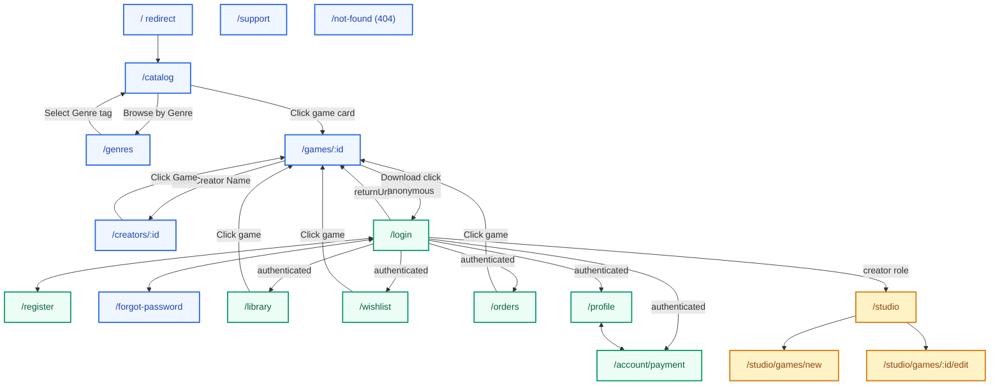

> **Legend:** 🔵 Public routes — 🟢 Auth-required routes — 🟠 Creator / stretch goal routes

---

## Route Table

| Route                   | Page              | Guard(s)                                                                                    | Role              | Component                 |
|-------------------------|-------------------|---------------------------------------------------------------------------------------------|-------------------|---------------------------|
| `/`                     | Redirect          | —                                                                                           | —                 | Redirects to `/catalog`   |
| `/catalog`              | Game Catalog      | None                                                                                        | Public            | `GameCatalogComponent`    |
| `/genres`               | Genre Directory   | None                                                                                        | Public            | `GenreDirectoryComponent` |
| `/games/:id`            | Game Detail       | None                                                                                        | Public            | `GameDetailComponent`     |
| `/creators/:id`         | Creator Portfolio | None                                                                                        | Public            | `CreatorProfileComponent` |
| `/login`                | Login             | None                                                                                        | Public            | `LoginComponent`          |
| `/register`             | Register          | None                                                                                        | Public            | `RegisterComponent`       |
| `/forgot-password`      | Forgot Password   | None                                                                                        | Public            | `ForgotPasswordComponent` |
| `/library`              | My Library        | `authGuard`                                                                                 | Any authenticated | `LibraryComponent`        |
| `/wishlist`             | Saved Games       | `authGuard`                                                                                 | Any authenticated | `WishlistComponent`       |
| `/orders`               | Order History     | `authGuard`                                                                                 | Any authenticated | `OrdersComponent`         |
| `/profile`              | User Profile      | `authGuard`                                                                                 | Any authenticated | `ProfileComponent`        |
| `/account/payment`      | Payment & Wallet  | `authGuard`                                                                                 | Any authenticated | `AccountPaymentComponent` |
| `/studio`               | Creator Studio    | `authGuard` + `roleGuard('creator')`                                                         | Creator           | `CreatorStudioComponent`  |
| `/studio/games/new`     | New Listing       | `authGuard` + `roleGuard('creator')` + `canDeactivate(unsavedChangesGuard)`                  | Creator           | `GameFormComponent`       |
| `/studio/games/:id/edit`| Edit Listing      | `authGuard` + `roleGuard('creator')` + `ownershipGuard` + `canDeactivate(unsavedChangesGuard)`| Creator (own)     | `GameFormComponent`       |
| `/support`              | Support & Privacy | None                                                                                        | Public            | `SupportComponent`        |
| `/not-found`            | 404 Not Found     | None                                                                                        | Public            | `NotFoundComponent`       |
| `**`                    | Wildcard Catch    | None                                                                                        | Public            | Redirects to `/not-found` |

---

## Page Inventory

### 1. Game Catalog (`/catalog`) — Public

The landing page. Browsable by anyone.

| Element              | Description                                                               |
|----------------------|---------------------------------------------------------------------------|
| **Search bar**       | Substring search against `game.title`, case-insensitive                   |
| **Tag filter chips** | Horizontal, single-select. Dynamic vocabulary from all games' `tags` arrays|
| **Game grid**        | CSS Grid of `game-card` components. 1 col < 768px, multi-col ≥ 768px       |
| **Empty state**      | Shown when search/filter yields zero results                              |
| **Loading spinner**  | Shown during simulated async fetch                                        |

**Data dependencies:** `GamesDataService.getGames(filters?)`

---

### 2. Game Detail (`/games/:id`) — Public

Single game's full information. The download button is the primary CTA.

| Element                     | Description                                                                             |
|-----------------------------|-----------------------------------------------------------------------------------------|
| **Hero cover image**        | Full-width `coverImageUrl`                                                              |
| **2-column layout**         | Info (title, creator name, description, tags) left; actions (download button, price) right|
| **Screenshot row**          | Horizontal scroll of `screenshotUrls`                                                   |
| **Download button**         | 5-state component (see below)                                                           |
| **Purchase confirm modal**  | Triggered when a logged-in user clicks "Buy" on a paid game                             |

**Data dependencies:** `GamesDataService.getGameById(id)`, `UsersDataService` (resolve `ownerId` → display name), `LibraryDataService.isOwned(userId, gameId)`

---

### 3. Login (`/login`) — Public

| Element                  | Description                                                        |
|--------------------------|--------------------------------------------------------------------|
| **Email / password form**| Validates against seeded users                                     |
| **Forgot password link** | Routes to `/forgot-password`                                       |
| **Demo account pills**   | Quick-login buttons for pre-seeded users                           |
| **Social login buttons** | Google & Apple SVG icon buttons (simulated 1-click)                |
| **Register link**        | Routes to `/register`                                              |
| **returnUrl support**    | After login, redirects to the page the user was trying to reach    |

**Data dependencies:** `AuthService.login()`

---

### 4. Register (`/register`) — Public

| Element                                 | Description                                        |
|-----------------------------------------|----------------------------------------------------|
| **Email / password / display name form**| Creates a new user in the mock store               |
| **"I want to publish games" toggle**    | Sets role to `creator` if checked                  |
| **Login link**                          | Routes to `/login`                                 |

**Data dependencies:** `AuthService.register()`

---

### 5. Forgot Password (`/forgot-password`) — Public

| Element                   | Description                                        |
|---------------------------|----------------------------------------------------|
| **Email form**            | Accepts email to send simulated reset link         |
| **Send Reset Link CTA**   | Triggers simulated password reset                  |
| **Confirmation feedback** | Success alert confirming link sent                 |
| **Back to login link**    | Routes back to `/login`                            |

**Data dependencies:** `AuthService.requestPasswordReset()`

---

### 6. My Library (`/library`) — Auth Required

| Element             | Description                                                                        |
|---------------------|------------------------------------------------------------------------------------|
| **Owned games list**| Each entry shows game title, cover thumbnail, acquired date, and a download button |
| **Download button** | "Download" for available games, "Unavailable" for soft-deleted games               |
| **Empty state**     | "You haven't acquired any games yet" with link to catalog                          |

**Data dependencies:** `LibraryDataService.getLibrary(userId)`, `GamesDataService.getGameById(id)` (for each entry)

---

### 7. Order History (`/orders`) — Auth Required

| Element                 | Description                                                        |
|-------------------------|--------------------------------------------------------------------|
| **Orders list / table** | Order ID, Game Title, Price snapshot ($), Purchase Date, Status    |
| **View game link**      | Navigates to `/games/:id`                                          |
| **Empty state**         | "No purchases yet" with CTA to browse games                        |

**Data dependencies:** `OrdersDataService.getOrders(userId)`, `GamesDataService.getGameById(id)`

---

### 8. User Profile (`/profile`) — Auth Required

| Element              | Description                                                    |
|----------------------|----------------------------------------------------------------|
| **Account info card**| User display name, email, member since, role badges            |
| **Role toggle**      | Enable Creator privileges toggle                               |
| **Demo data reset**  | Button to reset mock database to initial seed data             |
| **Logout button**    | Terminates session and redirects to `/catalog`                 |

**Data dependencies:** `AuthService.currentUser()`, `LocalStoreService.resetToSeedData()`

---

### 9. Creator Studio (`/studio`) — Creator Role Required

> [!NOTE]
> This is a **stretch goal** (Task 9, Phase 4). The architecture is fully designed but may not be implemented in the initial build.

| Element                     | Description                                                        |
|-----------------------------|--------------------------------------------------------------------|
| **Listing table**           | Title, price, date, Edit/Delete actions                            |
| **Create button**           | Routes to `/studio/games/new`                                      |
| **Soft-delete confirmation**| Modal before setting `deletedAt`                                   |

**Data dependencies:** `GamesDataService.getGames()` filtered by `ownerId === currentUserId`

---

### 10. Game Form (`/studio/games/new`, `/studio/games/:id/edit`) — Creator + Ownership

| Element             | Description                                                                    |
|---------------------|--------------------------------------------------------------------------------|
| **Reactive form**   | Title, description, price, cover URL, screenshot URLs, sample package URL      |
| **Tag chip input**  | Interactive add/remove with validation (1–5 tags, 2–20 chars each)              |
| **Validation**      | Full validation rules per [reference-data-models.md](./reference-data-models.md)|

**Data dependencies:** `GamesDataService.createGame()` or `GamesDataService.updateGame()`

---

### 11. 404 Not Found (`/not-found`, `**`) — Public

| Element                       | Description                                       |
|-------------------------------|---------------------------------------------------|
| **Error illustration / Icon** | Prominent 404 error header                        |
| **Help text**                 | Explains the requested game or page was not found |
| **Back to catalog CTA**       | Button routing back to `/catalog`                 |

**Data dependencies:** None

---

### 12. Support & Help Center (`/support`) — Public

| Element                       | Description                                                                               |
|-------------------------------|-------------------------------------------------------------------------------------------|
| **FAQ Accordion**             | Expandable answers to common questions (DRM, downloads, creator publishing, demo accounts)|
| **Contact / Ticket Form**     | Reactive inputs for name, email, subject, message with validation                         |
| **Simulated Submit Banner**   | Confirmation alert displaying submitted ticket ID and response SLA                        |
| **Privacy & Trust Notice**    | Dedicated card (`#privacy`) detailing local storage data, mock payments, and DRM policies |

**Data dependencies:** `AuthService.currentUser()` (pre-populates name/email if logged in)

---

### 13. Genre & Category Directory (`/genres`) — Public

| Element                       | Description                                                                               |
|-------------------------------|-------------------------------------------------------------------------------------------|
| **Category Cards Grid**       | Visual cards for major genres (RPG, Action, Sci-Fi, Indie) with dynamic game counts       |
| **Browse Link**               | Clicking any card navigates to `/catalog?tag={tag}`                                       |
| **Loading Spinner**           | Shown during initial aggregation fetch                                                    |

**Data dependencies:** `GamesDataService.getGames()`

---

### 14. Wishlist & Bookmarks (`/wishlist`) — Auth Required

| Element                       | Description                                                                               |
|-------------------------------|-------------------------------------------------------------------------------------------|
| **Saved Games Grid**          | CSS Grid of `game-card` components displaying user's bookmarked games                     |
| **Heart / Remove Action**      | Toggle bookmark off to remove game from wishlist                                          |
| **Empty State**               | "Your wishlist is empty" with CTA routing to `/catalog`                                   |

**Data dependencies:** `GamesDataService.getGames()`, `LocalStoreService` / `wishlistGameIds` signal

---

### 15. Creator Portfolio (`/creators/:id`) — Public

| Element                       | Description                                                                               |
|-------------------------------|-------------------------------------------------------------------------------------------|
| **Developer Hero Card**       | Creator avatar, display name, biography, joined date, and `[ Creator ]` badge             |
| **Published Games Grid**      | CSS Grid of `game-card` components filtered by `game.ownerId === creatorId`               |
| **Empty State**               | Shown if creator has no active public listings                                            |

**Data dependencies:** `UsersDataService.getUser(id)`, `GamesDataService.getGames()`

---

### 16. Payment & Wallet (`/account/payment`) — Auth Required

| Element                       | Description                                                                               |
|-------------------------------|-------------------------------------------------------------------------------------------|
| **Wallet Balance Hero**       | Displays current available balance in USD with quick `Top Up` CTA                         |
| **Saved Cards Section**       | Grid of credit cards (Visa / Mastercard) with default pill, expiry, and delete actions     |
| **Cambodian KHQR Section**    | Cards for Bakong, ABA, ACLEDA, and Wing mobile banking accounts with dynamic QR modals    |
| **Add Payment Method Form**   | Caret-safe card input form with `appCardNumber`, `appExpiryDate`, `appCvv` formatters     |
| **Gift Card Redemption**      | Input field to redeem prepaid vouchers (`NEXORA-GIFT-50`, etc.) into direct wallet funds  |
| **Transaction History Ledger**| Chronological table of all top-ups, purchases, and gift card redemptions                  |

**Data dependencies:** `PaymentsDataService.getMethods()`, `PaymentsDataService.getWalletSnapshot()`, `AuthService.currentUser()`

---

## Download Button — 5 States & Fulfillment Flow

The most complex component in the app. Its state depends on auth status, ownership, price, and game availability:

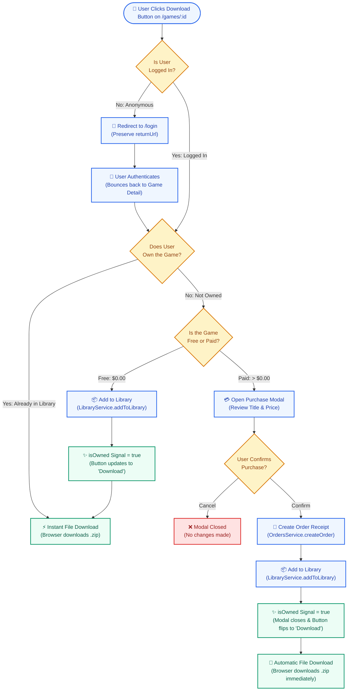

---

### Button State Machine

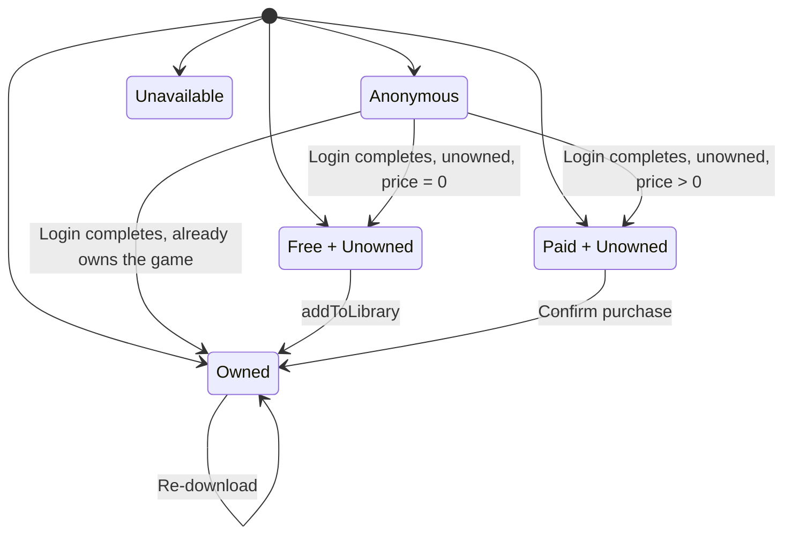

> **5 button states only.** `Anonymous` shows "Download" (redirects to login). `Free + Unowned` shows "Download Free". `Paid + Unowned` shows "Buy $X.XX" (opens confirm modal). `Owned` shows "Download". `Unavailable` is a terminal state (disabled).
>
> **Corrected 2026-08-17:** this diagram previously omitted the `Anonymous --> Owned` transition — a user who is bounced through login but already owns the game (e.g. re-downloading in a new browser session) goes straight to the "Owned" state, as the flowchart above it already showed via `CHECK_AUTH → REDIRECT → LOGIN_SUCCESS → CHECK_OWNED → DL_DIRECT`. This file's diagram is now consistent with its own flowchart and with `explanation-download-flow.md`.

| State              | Button Label     | Action                                                                                                             |
|--------------------|------------------|--------------------------------------------------------------------------------------------------------------------|
| **Anonymous**      | "Download"       | Redirect to `/login?returnUrl=...`                                                                                 |
| **Free + Unowned** | "Download Free"  | `addToLibrary()` → trigger direct file download                                                                    |
| **Paid + Unowned** | "Buy $X.XX"      | Open `purchase-confirm-modal` → on confirm: `createOrder()` + `addToLibrary()` → trigger file download → "Download" |
| **Owned**          | "Download"       | Trigger file download directly                                                                                     |
| **Unavailable**    | "Unavailable"    | Disabled, no action                                                                                                |

---

## Layout Shell

Every page is wrapped in a consistent layout shell:

```
┌─────────────────────────────────────────────────────────────────┐
│  Header                                                         │
│  [Logo/Title]  [Catalog] [Library?] [Orders?] [Studio?] [Profile]│
│                [Login/Logout] [DisplayName]                     │
│  ← hamburger menu at mobile                                     │
├─────────────────────────────────────────────────────────────────┤
│                                                                 │
│  <router-outlet />                                              │
│  (page content)                                                 │
│                                                                 │
├─────────────────────────────────────────────────────────────────┤
│  Footer — © copyright                                           │
└─────────────────────────────────────────────────────────────────┘
```

### Header Nav — Conditional Links

> Corrected 2026-08-17: this table previously omitted Genres from every state and Wishlist from Buyer/Creator, which disagreed with `design_doc.md`'s Task 4. `design_doc.md` is authoritative per its Document Precedence section — this table is now brought into line with it.

| Auth State    | Visible Nav Links                                                                                    |
|---------------|--------------------------------------------------------------------------------------------------------|
| **Anonymous** | Catalog · Genres · Login                                                                               |
| **Buyer**     | Catalog · Genres · Library · Wishlist · Orders · Profile · _[Display Name]_ · Logout                   |
| **Creator**   | Catalog · Genres · Library · Wishlist · Orders · Creator Studio · Profile · _[Display Name]_ · Logout   |

---

## Guard Chain

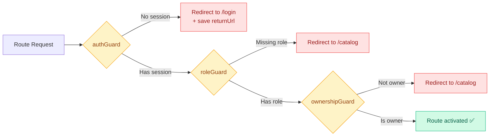

| Guard                  | Checks                             | Failure Redirect                     |
|------------------------|------------------------------------|--------------------------------------|
| `authGuard`            | `AuthService.currentUser()` exists | `/login?returnUrl=<attempted-route>` |
| `roleGuard('creator')` | `user.roles.includes('creator')`   | `/catalog`                           |
| `ownershipGuard`       | `game.ownerId === currentUser.id`  | `/catalog`                           |

---

## Data Flow — Layer Diagram

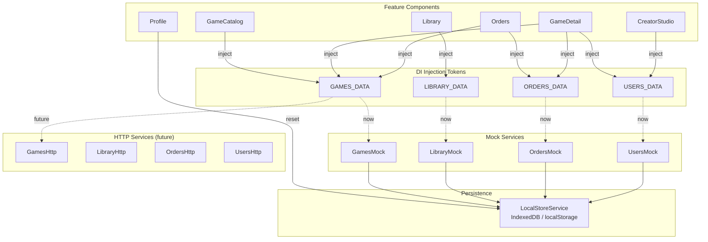

---

## Component Tree

```
AppComponent
├── HeaderComponent
│   ├── Logo / Title
│   ├── NavLinks (conditional on auth state)
│   ├── UserDisplay + Logout (if authenticated)
│   └── HamburgerMenu (mobile)
│
├── <router-outlet>
│   ├── GameCatalogComponent
│   │   ├── SearchInput
│   │   ├── TagFilterChips
│   │   ├── GameCardComponent[] (grid)
│   │   ├── LoadingSpinnerComponent
│   │   └── EmptyStateComponent
│   │
│   ├── GameDetailComponent
│   │   ├── Hero Cover Image
│   │   ├── Game Info (title, creator, description, tags)
│   │   ├── ScreenshotRow
│   │   ├── DownloadButtonComponent
│   │   └── PurchaseConfirmModalComponent
│   │
│   ├── LoginComponent
│   │   ├── EmailPasswordForm
│   │   ├── DemoAccountPills
│   │   └── SocialLoginButtons (Google, Apple SVGs)
│   │
│   ├── RegisterComponent
│   │   ├── RegistrationForm
│   │   └── CreatorToggle
│   │
│   ├── ForgotPasswordComponent
│   │   ├── ResetEmailForm
│   │   └── SuccessConfirmationBanner
│   │
│   ├── LibraryComponent
│   │   ├── OwnedGameEntry[] (list)
│   │   │   ├── GameThumbnail
│   │   │   └── DownloadButtonComponent
│   │   └── EmptyStateComponent
│   │
│   ├── OrdersComponent
│   │   ├── OrderReceiptRow[] (table)
│   │   └── EmptyStateComponent
│   │
│   ├── ProfileComponent
│   │   ├── AccountInfoCard (RoleBadges)
│   │   ├── CreatorPrivilegeToggle
│   │   └── ResetDemoDataButton
│   │
│   ├── CreatorStudioComponent (stretch)
│   │   ├── ListingTable
│   │   └── GameFormComponent (create/edit)
│   │       └── TagChipInput
│   │
│   ├── SupportComponent
│   │   ├── FaqAccordion
│   │   └── ContactTicketForm
│   │
│   └── NotFoundComponent (404)
│       ├── ErrorIcon / Typography
│       └── ReturnToCatalogCTA
│
└── FooterComponent
    ├── Copyright
    └── FooterNavLinks (Catalog, Support, Privacy)
```

---

## Shared UI Components

| Component                       | Purpose                              | Used By                 |
|---------------------------------|--------------------------------------|-------------------------|
| `GameCardComponent`             | Cover image, title, price badge      | Catalog                 |
| `DownloadButtonComponent`       | 5-state download CTA                 | Game Detail, Library    |
| `PurchaseConfirmModalComponent` | Game title + price + Confirm/Cancel  | Game Detail             |
| `LoadingSpinnerComponent`       | Consistent loading indicator         | Catalog, Detail, Library, Orders |
| `EmptyStateComponent`           | Icon + message + CTA                 | Catalog, Library, Orders, Studio |
| `RoleBadgeComponent`            | Buyer/Creator badge                  | Header, Profile         |
| `TagChipInputComponent`         | Add/remove tag chips with validation | Game Form (stretch)     |

---

## User Flows & Sequence Diagrams

---

### Flow 1: Gated Download (Primary Demo Flow)

The primary user journey demonstrating auth gating, role-based behavior, catalog exploration, library persistence, and sample package downloading.

#### Visual Flowchart

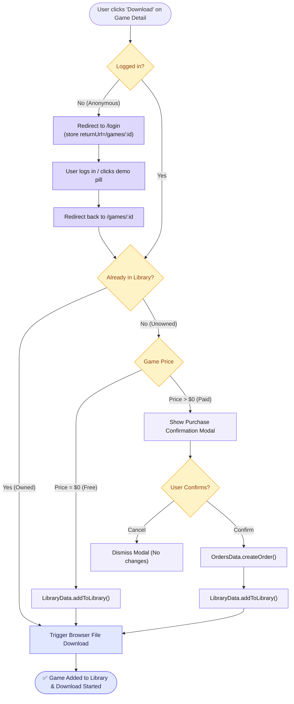

#### Sequence Diagram

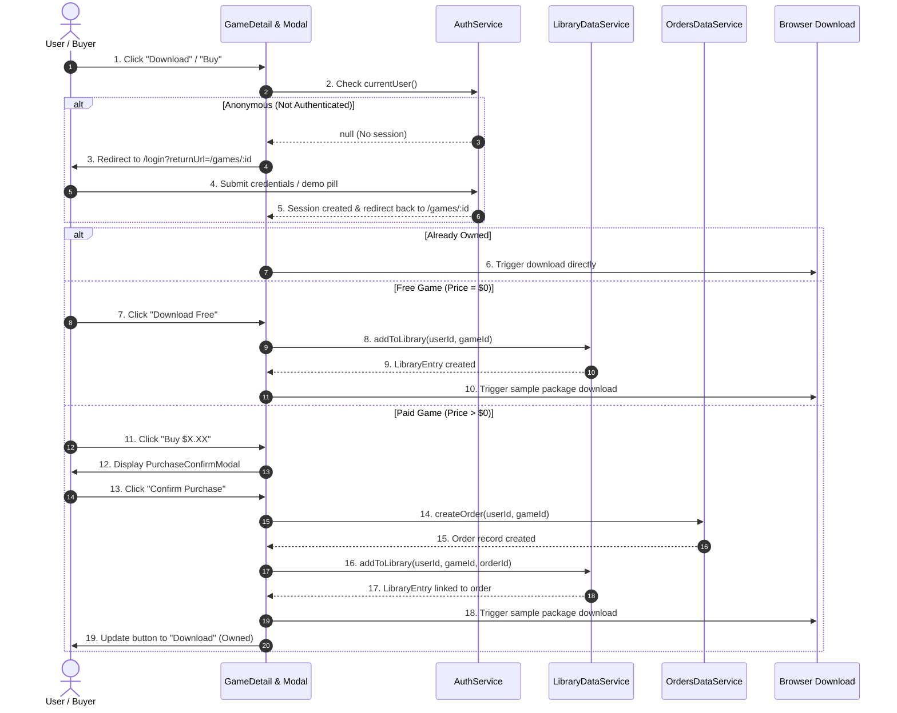

#### Step-by-Step Breakdown

| Step   | Phase             | Trigger / Action                               | System Behavior & State Transition                                                        |
|:------:|-------------------|------------------------------------------------|-------------------------------------------------------------------------------------------|
| **1**  | **Discovery**     | User browses `/catalog` and clicks a game card | Route navigates to `/games/:id`. Resolves game details, creator name, and ownership state.|
| **2**  | **Auth Check**    | User clicks CTA button                         | Reads `AuthService.currentUser()`. If `null`, redirects to `/login` with `returnUrl`.     |
| **3**  | **Auth Return**   | User completes login                           | Sets active user signal; router returns user directly to the original `/games/:id` page. |
| **4A** | **Free Download** | User clicks `"Download Free"`                  | Calls `LIBRARY_DATA.addToLibrary()`. Creates `LibraryEntry`, state $\rightarrow$ `Owned`. |
| **4B** | **Paid Purchase** | User clicks `"Buy $X.XX"`                      | Opens modal. On confirm: calls `ORDERS_DATA.createOrder()` then `addToLibrary()`.         |
| **5**  | **File Delivery** | Entry recorded                                 | Emits file download of `samplePackageUrl`, updates button state to `"Download"`.          |

---

### Flow 2: Authentication, Demo Quick-Login & Return Navigation

Handles credential verification, 1-click demo account switching, social sign-in simulation, and deep-link returnUrl preservation.

#### Visual Flowchart

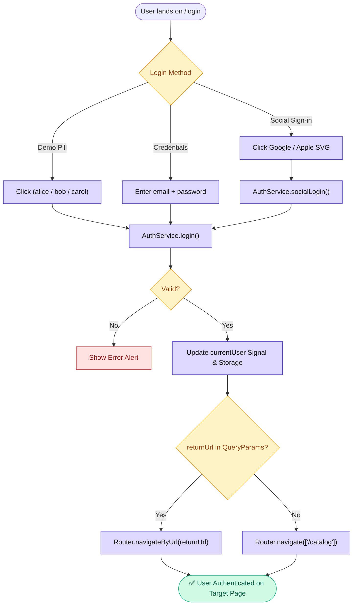

#### Sequence Diagram

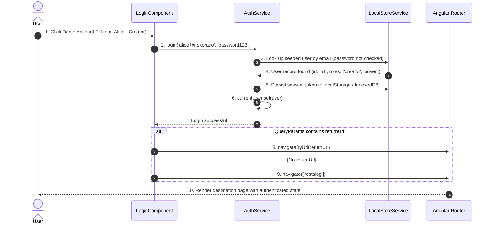

#### Step-by-Step Breakdown

| Step  | Action           | Description                                                                                                                              |
|:-----:|------------------|------------------------------------------------------------------------------------------------------------------------------------------|
| **1** | **User Trigger** | User either enters credentials, clicks Google/Apple SVG, or clicks a pre-seeded Demo Account pill.                                       |
| **2** | **Lookup**       | `AuthService` matches the submitted email against seeded accounts (password is ignored — mock only) and creates session state.           |
| **3** | **State Update** | `currentUser` signal is updated, header reactive signals re-render (display name, avatar, conditional Creator Studio links).             |
| **4** | **Redirection**  | If user arrived via a guard redirect (e.g., trying to download a game), `returnUrl` is loaded to resume context immediately.             |

---

### Flow 3: Route Guard Chain Execution

Demonstrates the 3-tier defense-in-depth protection for protected routes (`/library`, `/orders`, `/profile`, `/studio`, `/studio/games/:id/edit`).

#### Visual Flowchart

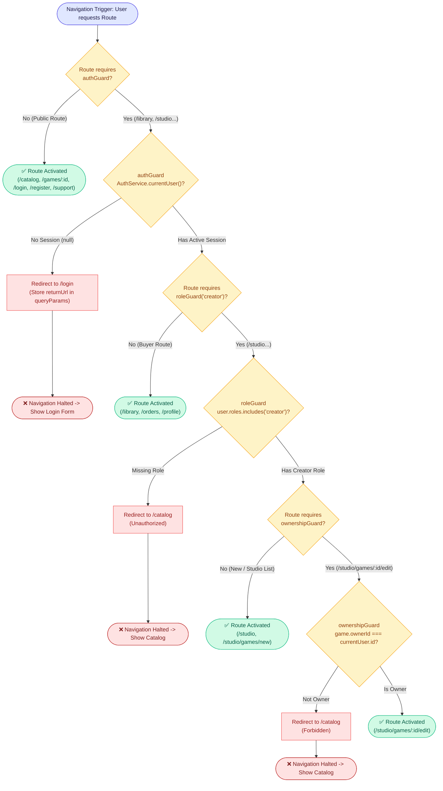

#### Sequence Diagram

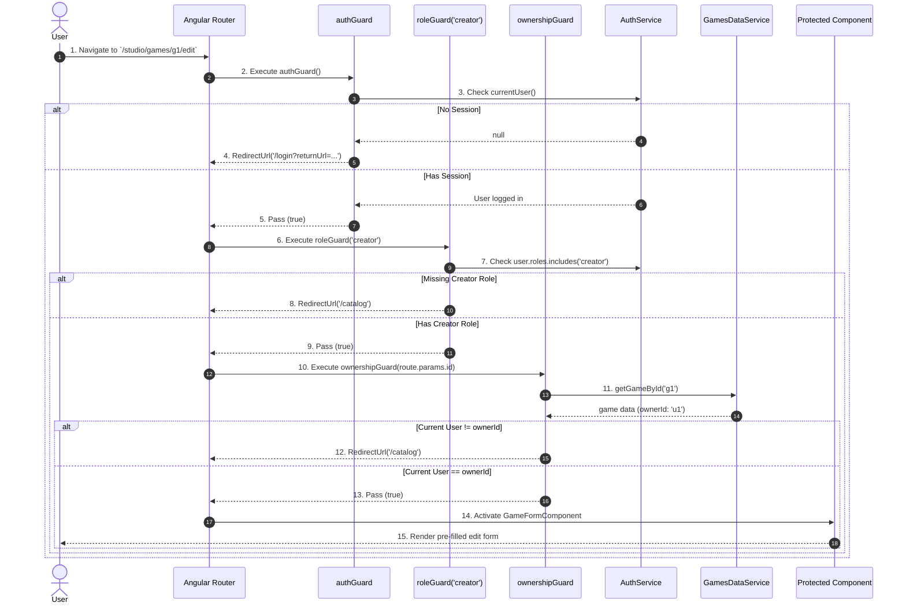

#### Step-by-Step Breakdown

| Step  | Guard Layer               | Evaluated Condition                    | Success Action                                  | Failure Action & Redirect                                          |
|:-----:|---------------------------|----------------------------------------|-------------------------------------------------|--------------------------------------------------------------------|
| **1** | **`authGuard`**           | `AuthService.currentUser() !== null`   | Allow pipeline to continue to next guard.       | Cancel navigation $\rightarrow$ Redirect to `/login?returnUrl=...`|
| **2** | **`roleGuard('creator')`**| `currentUser.roles.includes('creator')`| Allow pipeline to continue to next guard.       | Cancel navigation $\rightarrow$ Redirect to `/catalog`             |
| **3** | **`ownershipGuard`**      | `targetGame.ownerId === currentUser.id`| Activate requested route and render component.  | Cancel navigation $\rightarrow$ Redirect to `/catalog`             |

#### Guard Matrix Reference

| Route                   | Guard Sequence                                        | Check Criteria                    | On Fail Redirect             |
|-------------------------|-------------------------------------------------------|-----------------------------------|------------------------------|
| `/library`              | `[authGuard]`                                         | `currentUser() !== null`          | `/login?returnUrl=/library`  |
| `/wishlist`             | `[authGuard]`                                         | `currentUser() !== null`          | `/login?returnUrl=/wishlist` |
| `/orders`               | `[authGuard]`                                         | `currentUser() !== null`          | `/login?returnUrl=/orders`   |
| `/profile`              | `[authGuard]`                                         | `currentUser() !== null`          | `/login?returnUrl=/profile`  |
| `/studio`               | `[authGuard, roleGuard('creator')]`                   | `roles.includes('creator')`       | `/catalog`                   |
| `/studio/games/new`     | `[authGuard, roleGuard('creator')]`                   | `roles.includes('creator')`       | `/catalog`                   |
| `/studio/games/:id/edit`| `[authGuard, roleGuard('creator'), ownershipGuard]`   | `game.ownerId === currentUser.id` | `/catalog`                   |

---

### Flow 4: Creator Game Publishing & Editing Flow (Stretch)

Demonstrates how creators scaffold, validate, publish, and persist game listings into the mock IndexedDB store.

#### Visual Flowchart

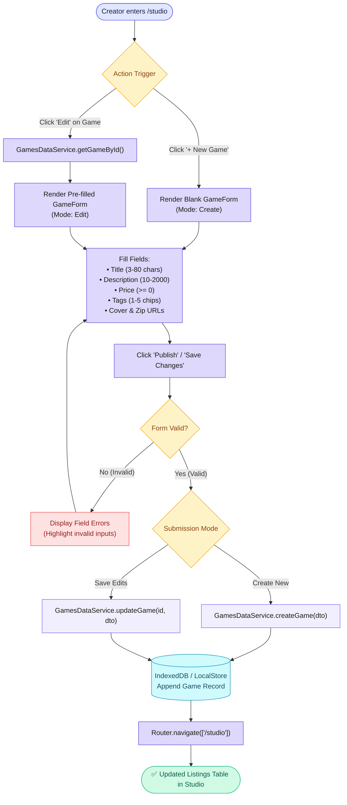

#### Sequence Diagram

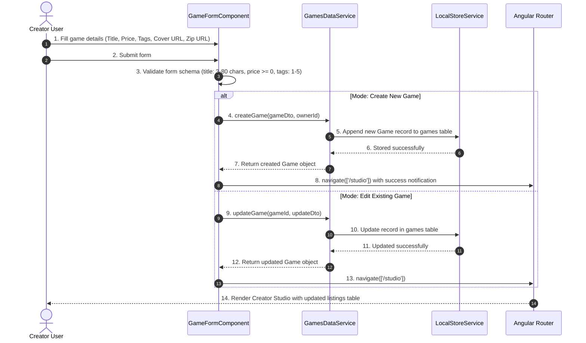

#### Step-by-Step Breakdown

| Step   | Phase               | Action / Event                                                 | State & Storage Mutation                                                                  |
|:------:|---------------------|----------------------------------------------------------------|-------------------------------------------------------------------------------------------|
| **1**  | **Form Initiation** | Creator navigates to `/studio/games/new` or `/studio/games/...`| If editing, fetches game via `GAMES_DATA.getGameById()` and pre-fills reactive controls.  |
| **2**  | **Tag Management**  | User inputs tags in `TagChipInputComponent`                    | Validates chip constraints (1–5 tags, 2–20 characters per tag, no duplicates).            |
| **3**  | **Validation**      | Creator clicks submit                                          | Synchronous validation runs across fields. Errors highlight affected inputs.              |
| **4A** | **Create Branch**   | Valid new listing submitted                                    | Invokes `createGame()`, generates new UUID, assigns `ownerId`, persists to IndexedDB.     |
| **4B** | **Edit Branch**     | Valid edits submitted                                          | Invokes `updateGame()`, updates existing record in IndexedDB `games` store.               |
| **5**  | **Confirmation**    | Storage transaction resolves                                   | Router navigates to `/studio`, displays success toast notification, table refreshes.      |

---

## Responsive Breakpoints

| Breakpoint             | Behavior                                                               |
|------------------------|------------------------------------------------------------------------|
| **< 768px** (mobile)   | Single-column catalog grid · Hamburger nav · Stacked game detail layout |
| **≥ 768px** (tablet+)  | Multi-column catalog grid · Horizontal nav · 2-column game detail       |

---

## Design Tokens Reference

```css
/* ==========================================================================
   NEXORA DESIGN TOKENS (CSS Custom Properties)
   ========================================================================== */
:root {
  /* Brand Primary — Electric Violet */
  --accent-400:    #A78BFA;
  --accent-500:    #8B5CF6;  /* glow highlights */
  --accent-600:    #7C3AED;  /* primary brand CTA / active links */
  --accent-700:    #6D28D9;  /* hover & active states */

  /* Cyber Accents */
  --cyan-400:      #22D3EE;  /* cyber cyan — info badges, genre chips */
  --cyan-500:      #06B6D4;
  --emerald-400:   #34D399;  /* neon emerald — owned badges, free tags */
  --emerald-500:   #10B981;
  --rose-500:      #F43F5E;  /* neon danger — soft delete modal, errors */

  /* Surfaces & Backgrounds */
  --bg-void:       #0B0D13;  /* root canvas background */
  --bg-surface:    #131622;  /* game cards, header, sidebar */
  --bg-elevated:   #1A1E2E;  /* modals, popovers, dropdowns */
  --bg-input:      #0E111B;  /* form inputs, search bar */

  /* Semantic Text Colors */
  --text-primary:   #F8FAFC;  /* main headlines & titles */
  --text-secondary: #94A3B8;  /* descriptions & metadata */
  --text-muted:     #64748B;  /* placeholders, timestamps */

  /* Borders & Glow Effects */
  --border-card:    #1E2438;
  --border-subtle:  rgba(139, 92, 246, 0.15);
  --border-glow:    rgba(139, 92, 246, 0.4);
  --shadow-glow:    0 0 20px rgba(124, 58, 237, 0.25);

  /* Spacing Scale */
  --space-1: 4px;
  --space-2: 8px;
  --space-3: 12px;
  --space-4: 16px;
  --space-6: 24px;
  --space-8: 32px;

  /* Border Radii */
  --radius-sm: 4px;
  --radius:    8px;   /* standard button / card radius */
  --radius-lg: 12px;  /* modal container radius */

  /* Typography */
  --font-sans: 'Outfit', 'Inter', -apple-system, BlinkMacSystemFont, 'Segoe UI', Roboto, sans-serif;
}
```
